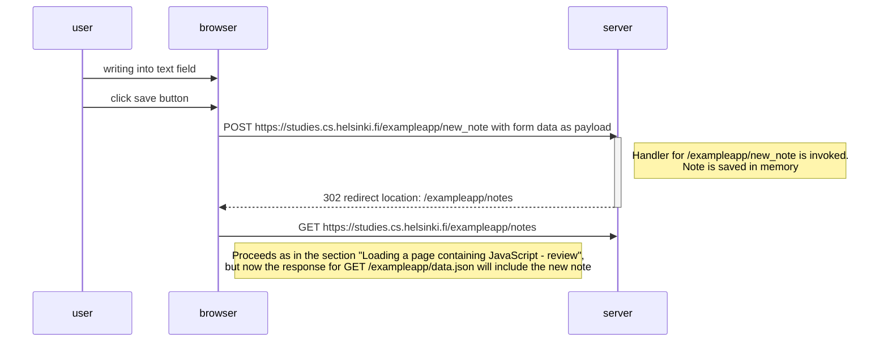

```mermaid
sequenceDiagram
    participant user
    participant browser
    participant server

    user->>browser: writing into text field
    user->>browser: click save button

    browser->>server: POST https://studies.cs.helsinki.fi/exampleapp/new_note with form data as payload
    activate server

    note right of server: Handler for /exampleapp/new_note is invoked. <br>Note is saved in memory
    server-->>browser: 302 redirect location: /exampleapp/notes
    deactivate server

    browser->>server: GET https://studies.cs.helsinki.fi/exampleapp/notes
    note right of browser: Proceeds as in the section "Loading a page containing JavaScript - review", <br>but now the response for GET /exampleapp/data.json will include the new note
```