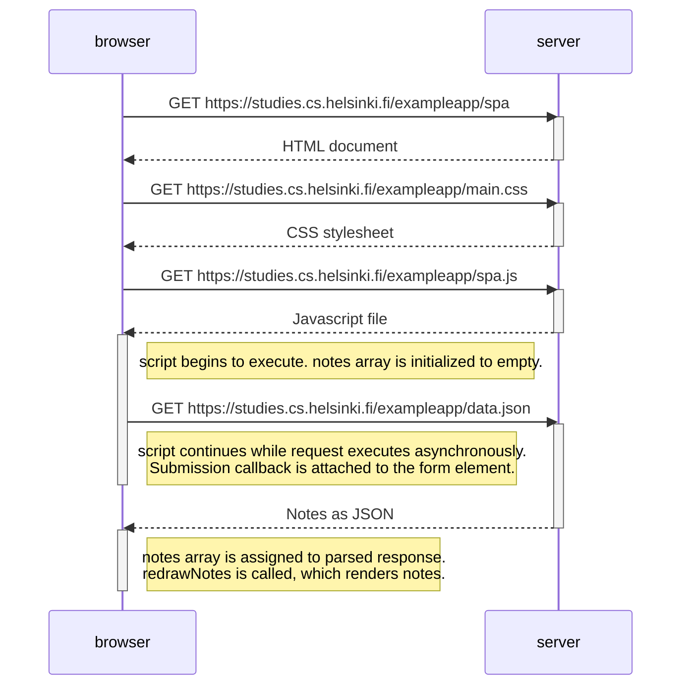

```mermaid
sequenceDiagram
    participant browser
    participant server

    browser->>server: GET https://studies.cs.helsinki.fi/exampleapp/spa
    activate server
    server-->>browser: HTML document
    deactivate server

    browser->>server: GET https://studies.cs.helsinki.fi/exampleapp/main.css
    activate server
    server-->>browser: CSS stylesheet
    deactivate server

    browser->>server: GET https://studies.cs.helsinki.fi/exampleapp/spa.js
    activate server
    server-->>browser: Javascript file
    deactivate server

    activate browser
    note right of browser: script begins to execute. notes array is initialized to empty.

    browser->>server: GET https://studies.cs.helsinki.fi/exampleapp/data.json
    activate server
    note right of browser: script continues while request executes asynchronously. <br>Submission callback is attached to the form element.
    deactivate browser

    server-->>browser: Notes as JSON
    deactivate server

    activate browser
    note right of browser: notes array is assigned to parsed response. <br>redrawNotes is called, which renders notes.
    deactivate browser
```