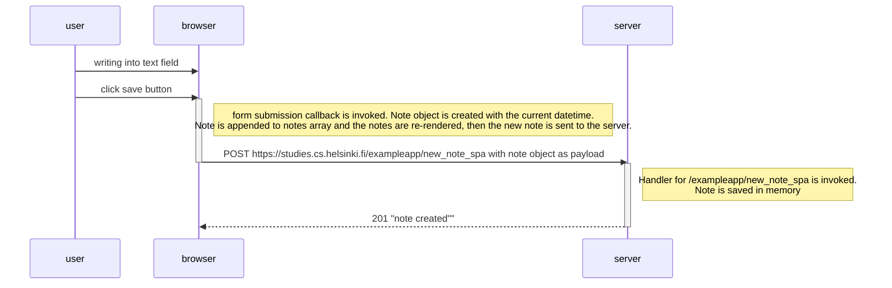

```mermaid
sequenceDiagram
    participant user
    participant browser
    participant server

    user->>browser: writing into text field
    user->>browser: click save button

    activate browser
    note right of browser: form submission callback is invoked. Note object is created with the current datetime. <br>Note is appended to notes array and the notes are re-rendered, then the new note is sent to the server.

    browser->>server: POST https://studies.cs.helsinki.fi/exampleapp/new_note_spa with note object as payload
    deactivate browser
    activate server

    note right of server: Handler for /exampleapp/new_note_spa is invoked. <br>Note is saved in memory
    server-->>browser: 201 "note created""
    deactivate server
```